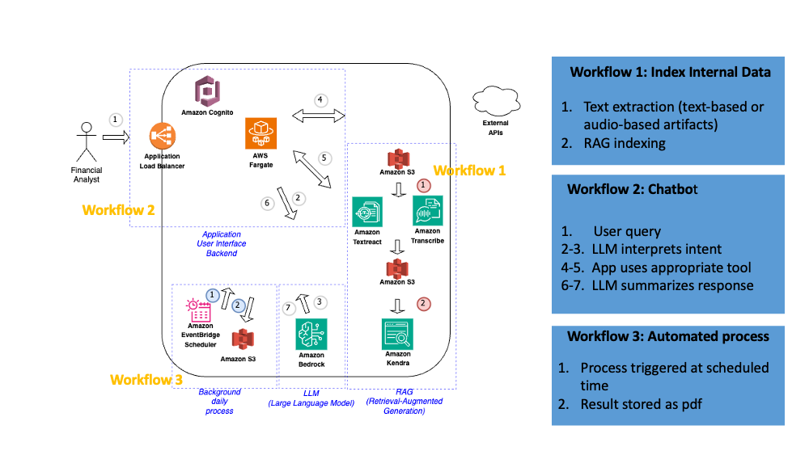

# MRKL Financial Chatbot Demo With Amazon Bedrock

This demo was inspired by the [MRKL architecture](https://arxiv.org/abs/2205.00445), using the following demos as starting point:
- [Langchain Streamlit chatbot demo](https://github.com/langchain-ai/streamlit-agent/tree/main)
- [Amazon Bedrock demo](https://github.com/aws-samples/amazon-bedrock-workshop/blob/main/07_Agents/01_LLM_Claude_Agent_Stock_Analysis.ipynb). 

It also uses [streamlit-cognito-auth](https://pypi.org/project/streamlit-cognito-auth/) for Amazon Cognito  authentication.

## Caveats:
- Not production ready!
- This is an experiment only, any suggestions generated by this application shouldnt be taken as financial advice
- This is a personal educational project not affiliated with any company
- Langchain agent is heavily influenced by the prompt used. Finding a prompt that works for all types of searches is more of an art than science
- [QUESTIONS.md](QUESTIONS.md) has example questions, including some that will break this current implementation. Just refresh the page and problem solved.
- As perspective of how others have been experiencing Langchain, check the discussion at [Hackernews](https://news.ycombinator.com/item?id=36725982). In summary great for demos, challenging for production. Alternatives suggested in the post.

## UI/UX


## Architecture


## Chatbot

### Local Deployment

1. Add AWS credentials:
```
aws configure --profile <profile-name>
```

2. Create/update utils/.env file and .env file
3. If not using Amazon Kendra, you can remove the "query_call_transcript" references from utils/tools.py and from app.py.
4. Execute
```
python3.9 -m venv venv
source venv/bin/activate
pip install -r requirements.txt
streamlit run app.py
```

### Amazon Fargate Deployment
Note: If you dont/cant use Docker, you can replace the instances o "docker" below with "finch" ([Finch](https://aws.amazon.com/blogs/opensource/introducing-finch-an-open-source-client-for-container-development/) is an open source Docker alternative)

1. Create container locally and push to Amazon Container Registry
```
# If using mac:
docker --platform=amd64  build -t ab3-chatbot-demo .
# If using pc:
# docker build -t ab3-chatbot-demo .

# Go to AWS Elastic Container Service, create a new registry, copy the information given in the AWS console and execute it in the terminal.
# It should be something like
# aws ecr get-login-password --region us-east-1 --profile ...
# docker tag ab3-chatbot-demo:latest ...
# docker push ...
```
2. Create a Fargate ECS Cluster
3. Create a Task Template
4. Point this Task Template to the container in the registry, and port 8501
5. Create a Service in the Fargate cluster
6. If desired you can also create an Application Load Balancer when creating this service 
7. Alternatively you can access it by the Task's public IP (unless you set it to private)

## Background Process

Instead of Chatbot UI, it will execute the langchain with static command "Is [company] a good investment?", and upload a pdf to the S3 bucket configured in utils/.env

Execute:
```
python background_process/back.py
```

## Lambdas

In the [/lambda](/lambda) folder you will find:
- *task-generate-pdf-report.py*: Meant to be called by an AWS Event Bridge Scheduler, will trigger a previously defined container task [/background_process/back.py](/background_process/back.py), registered in Amazon Fargate, which will run the agent and generate a pdf report, to be stored in a S3 bucket. Example of report generated at [files/Daily_Report2023-12-18-152401.pdf](files/Daily_Report2023-12-18-152401.pdf)
- *infra-start-stop-fargate-service.py*: Assuming the MRKL Chatbot is deployed as a Amazon Fargate service, can be called by a AWS EventBridge Scheduler to start/stop the service at the start/end of the day, to save on costs.
- *task-transcribe-audio.py*: Example of how to call Amazon Transcribe to convert audio stored in a S3 bucket to text, that can be indexed by a RAG
- For Amazon Textract, refer to [Textractor](https://github.com/aws-samples/amazon-textract-textractor)
